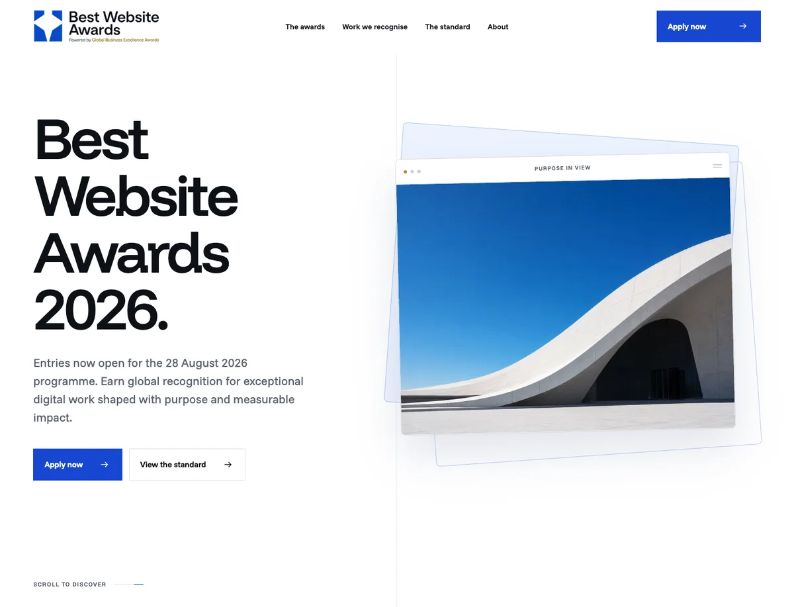

<p align="center">
  <a href="https://bestwebsiteaward.com/" aria-label="Visit Best Website Awards">
    
  </a>
</p>

<h1 align="center">Best Website Awards</h1>

<p align="center">
  The production website for Best Website Awards, powered by
  <a href="https://gbeaward.com/">Global Business Excellence Awards</a>.
</p>

<p align="center">
  <a href="https://bestwebsiteaward.com/"></a>
  <a href="https://astro.build/"></a>
  <a href="https://www.typescriptlang.org/"></a>
  <a href="https://tailwindcss.com/"></a>
  <a href="./LICENSE"></a>
</p>

<p align="center">
  <a href="https://bestwebsiteaward.com/">Live website</a> &nbsp;·&nbsp;
  <a href="https://bestwebsiteaward.com/sitemap.xml">Sitemap</a> &nbsp;·&nbsp;
  <a href="https://bestwebsiteaward.com/contact">Contact</a> &nbsp;·&nbsp;
  <a href="https://gbeaward.com/">GBE Awards</a>
</p>

<p align="center">
  <a href="https://bestwebsiteaward.com/">
    
  </a>
</p>

## About this repository

This repository contains the public-facing Best Website Awards website. It is intentionally focused: concise editorial pages, a clear evaluation framework, an accessible enquiry journey, strong search foundations, and no public-voting flow.

The site uses Astro's static-first architecture. Every public page, `robots.txt`, and the direct sitemap are pre-rendered. The contact endpoint is the only Vercel function. Typed content and managed-media boundaries keep the presentation layer ready for a future Neon and Cloudflare R2-backed content source without coupling components to a database or storage provider today.

The separate admin and awards portal applications are not part of this repository.

## Production architecture

| Surface                        | Delivery                           | Source                         | Cache and indexing                                      |
| ------------------------------ | ---------------------------------- | ------------------------------ | ------------------------------------------------------- |
| 11 public pages                | Pre-rendered HTML on Vercel's edge | Typed, versioned local content | Layered browser and CDN caching; indexable              |
| `sitemap.xml` and `robots.txt` | Pre-rendered static files          | Site route configuration       | CDN cached; sitemap exposes the canonical public routes |
| `/_astro/*`                    | Fingerprinted static assets        | Astro build pipeline           | One-year immutable caching                              |
| `/api/contact`                 | One isolated Vercel function       | Validated form submission      | `no-store`; `noindex, nofollow`                         |
| Programme images               | Astro build-time image pipeline    | `ManagedPicture.astro`         | Responsive AVIF/WebP output with explicit dimensions    |

The generated Vercel output is hardened after each build. Unused runtime image and server-island routes are removed, and the verification gate proves that only `/api/contact` maps to server compute.

## Technology

| Area                   | Implementation                                                 |
| ---------------------- | -------------------------------------------------------------- |
| Framework              | Astro 7 with the Vercel adapter                                |
| Styling                | Tailwind CSS 4 using the `tw:` prefix, plus focused global CSS |
| Language               | TypeScript 6 in strict mode                                    |
| Images                 | Astro assets, Sharp, responsive AVIF and WebP variants         |
| Typography             | Self-hosted Funnel Display and Funnel Sans variable fonts      |
| Motion                 | Motion with reduced-motion-safe behavior                       |
| Icons                  | Lucide Astro and Font Awesome brand SVGs                       |
| Unit and content tests | Vitest                                                         |
| Browser tests          | Playwright on desktop Chromium and mobile Chromium             |
| Analytics              | Consent-gated Google Analytics 4 with Consent Mode v2          |
| Form protection        | Cloudflare Turnstile                                           |
| Email delivery         | Resend                                                         |
| Hosting                | Vercel behind Cloudflare                                       |

## Public routes

| Route             | Purpose                                            |
| ----------------- | -------------------------------------------------- |
| `/`               | Programme introduction and primary entry journey   |
| `/awards`         | Award purpose, principles, and recognition context |
| `/work`           | Types of digital work recognised                   |
| `/standard`       | Four-measure evaluation framework                  |
| `/process`        | Entry and recognition journey                      |
| `/about`          | Organisation and parent-brand context              |
| `/faq`            | Programme questions and structured FAQ content     |
| `/contact`        | Protected enquiry and website submission form      |
| `/privacy-policy` | Privacy information                                |
| `/terms`          | Website and programme terms                        |
| `/cookies`        | Analytics consent and cookie information           |

The branded 404 experience and `/api/*` remain non-indexable. All canonical public routes are published at [bestwebsiteaward.com/sitemap.xml](https://bestwebsiteaward.com/sitemap.xml).

## Repository structure

```text
src/
├── assets/
│   ├── brand/                 # Primary and reversed brand artwork
│   └── generated/             # Programme imagery transformed at build time
├── components/                # Reusable Astro presentation components
├── data/                      # Versioned public content records
├── layouts/                   # Shared public and editorial page shells
├── lib/
│   ├── content/               # Typed content-source boundary
│   └── contact.ts             # Contact validation and escaping
├── pages/
│   ├── api/contact.ts         # The only server-rendered endpoint
│   ├── *.astro                # Pre-rendered public routes
│   ├── robots.txt.ts
│   └── sitemap.xml.ts
├── scripts/                   # Browser behavior and motion
└── styles/                    # Global design system and Tailwind entry

scripts/
├── harden-vercel-output.mjs   # Removes unused generated runtime routes
├── verify-seo.mjs             # Verifies metadata, schema, indexing, and caching
└── verify-vercel-output.mjs   # Verifies static output and function isolation

tests/
├── contact/                   # Validation and endpoint contracts
├── content/                   # Content and sitemap contracts
└── e2e/                       # Desktop and mobile browser coverage
```

## Getting started

### Requirements

- Node.js 22.12 or newer
- npm, using the lockfile committed to this repository

### Install and run

```sh
git clone https://github.com/codezelat/best-website-award-website.git
cd best-website-award-website
npm ci
npm run dev
```

The development server runs at [http://localhost:4321](http://localhost:4321).

The public pages work without contact-provider credentials. Add the environment variables below when testing the real contact flow.

## Environment variables

Create an ignored `.env` file from the committed contract:

```sh
cp .env.example .env
```

| Variable                    | Exposure    | Purpose                                   |
| --------------------------- | ----------- | ----------------------------------------- |
| `PUBLIC_TURNSTILE_SITE_KEY` | Public      | Renders the Cloudflare Turnstile widget   |
| `TURNSTILE_SECRET_KEY`      | Server only | Verifies Turnstile tokens with Cloudflare |
| `RESEND_API_KEY`            | Server only | Authenticates contact-email delivery      |
| `CONTACT_TO_EMAIL`          | Server only | Receives accepted programme enquiries     |
| `CONTACT_FROM_EMAIL`        | Server only | Verified Resend sender identity           |

Never commit `.env`, provider keys, or copied Vercel environment files. Production values are stored as encrypted Vercel environment variables.

## Contact delivery

The contact flow is deliberately isolated from the static site:

1. The browser submits `multipart/form-data` to `/api/contact`.
2. The endpoint validates origin, content type, field lengths, email and URL formats, privacy acceptance, and the anti-bot honeypot.
3. Cloudflare Turnstile is verified server-side with a bounded upstream timeout.
4. Accepted content is escaped before the email template is built.
5. Resend delivers the enquiry to the configured programme inbox.
6. Every API response is returned with `no-store` and `X-Robots-Tag: noindex, nofollow`.

The function has a 15-second Vercel duration limit, while individual provider calls use shorter timeouts so requests fail predictably.

## Content and media

Public components do not import CMS or database records directly. They consume typed contracts from [`src/lib/content/types.ts`](./src/lib/content/types.ts) through the content-source modules in [`src/lib/content/`](./src/lib/content/).

Current content is versioned in [`src/data/`](./src/data/). When the separate admin application is connected, the source adapters can be replaced with validated Neon-backed implementations while keeping the component contract stable.

Programme media is rendered through [`ManagedPicture.astro`](./src/components/ManagedPicture.astro). It accepts either Astro image metadata or a validated remote URL, which provides one rendering contract for the current local assets and future Cloudflare R2 media. Every image must retain meaningful alternative text and explicit dimensions.

Do not add dates, fees, winners, judges, sponsors, category totals, or programme claims unless they come from an approved programme source.

## SEO, analytics, and privacy

[`SeoHead.astro`](./src/components/SeoHead.astro) owns canonical URLs, robots directives, Open Graph metadata, Twitter metadata, and JSON-LD. The verification script checks rendered production output rather than only checking source props.

The site provides:

- One canonical URL per public page
- Indexable privacy, terms, cookies, FAQ, contact, and editorial pages
- A branded non-indexable 404 page
- Direct sitemap and robots routes
- Page-appropriate structured data, including FAQ schema
- HTTPS and canonical host redirects
- Explicit noindex and no-store rules for API responses

Google Analytics 4 uses measurement ID `G-L2FR8JR6ZJ`. Analytics is not requested until a visitor selects **Yes, help improve**. Consent Mode v2 starts with analytics and advertising storage denied. Advertising signals and Google Signals remain disabled after analytics consent. Visitors can change their choice through **Cookie settings** in the footer.

The cache policy includes `no-transform`, preventing intermediary services from rewriting production HTML or injecting another analytics script.

## Performance, caching, and security

[`vercel.json`](./vercel.json) applies:

- Five-minute browser caching for public documents
- One-hour shared CDN freshness with a one-day stale-while-revalidate window
- One-day Vercel CDN freshness with a seven-day stale-while-revalidate window
- One-year immutable caching for fingerprinted `/_astro/*` assets
- No caching for `/api/*`
- Content Security Policy, HSTS, frame denial, MIME sniffing protection, strict referrer policy, and a restrictive permissions policy

The production domain is proxied through Cloudflare. Cloudflare should use a Cache Rule that makes successful public `GET` and `HEAD` responses eligible for caching, respects origin cache headers, keeps `/_astro/*` cacheable, and bypasses `/api/*`.

Accessibility is part of the component contract: semantic landmarks, keyboard navigation, visible focus, skip links, descriptive image alternatives, responsive layouts, and reduced-motion behavior are covered by implementation and browser tests.

## Commands

| Command                  | Purpose                                                          |
| ------------------------ | ---------------------------------------------------------------- |
| `npm run dev`            | Start the Astro development server                               |
| `npm run build`          | Build production output and harden the generated Vercel manifest |
| `npm run preview`        | Preview the production build locally                             |
| `npm run check`          | Run Astro and TypeScript diagnostics                             |
| `npm run test`           | Run Vitest content and endpoint tests                            |
| `npm run test:e2e`       | Run desktop and mobile Playwright tests                          |
| `npm run verify:runtime` | Prove static-route output and contact-function isolation         |
| `npm run verify:seo`     | Verify rendered SEO, analytics, privacy, and cache contracts     |
| `npm run format`         | Format supported files with Prettier                             |
| `npm run verify`         | Run the standard production release gate                         |
| `npm run verify:full`    | Run the full release gate plus browser tests                     |

## Release workflow

Before a production push:

```sh
npm ci
npm run verify:full
npm audit --omit=dev
git diff --check
```

`npm run build` writes the Build Output API structure to `.vercel/output`. The runtime verifier then proves that:

- Every public route is emitted as a static file
- Sitemap and robots are static
- Only `/api/contact` maps to the Vercel function
- Unused runtime image and server-island routes are absent
- Sharp native binaries are not packaged into the contact function
- No top-level middleware, authentication package, or database client has entered this public runtime

Pushes to the connected production branch deploy through Vercel. After deployment, confirm the Vercel status is **Ready**, check the public domain and direct Vercel alias, and verify live caching, SEO, sitemap, robots, 404, and API response headers.

## Future data sources

The current public content source is static, so public pages are safely pre-rendered. A future Neon or CMS-backed route must opt out of prerendering until it has a reliable invalidation strategy. Data-backed public responses should preserve the existing layered cache contract, while admin, authenticated, preview, and mutation routes must remain `no-store` and non-indexable.

## License

Copyright © 2026 Codezela Technologies. All rights reserved.

This repository and its code, design system, content workflows, brand assets, and related materials are proprietary. See the full [Proprietary License](./LICENSE) for the authorised-use terms. Third-party dependencies remain governed by their respective licenses.
